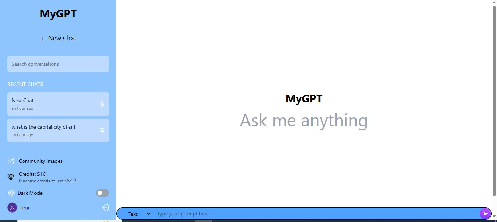
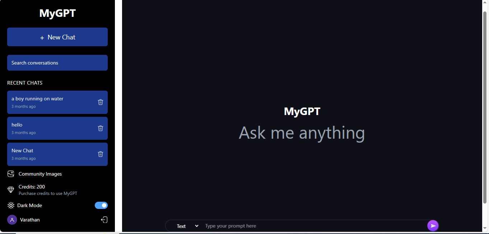

# 🚀 MyGPT - AI Chatbot Application (MERN + Gemini + ImageKit + Stripe)

MyGPT is a full-stack AI chatbot application inspired by ChatGPT & Google Gemini.  
Users can chat with AI, generate AI-images, and purchase credits securely using Stripe.  
This project is built using **MERN Stack**, **Google Gemini AI**, **ImageKit**, and **Stripe Payments**.

---

### 🌐 Live Demo  
👉 (https://chatwithmygpt.vercel.app/)
---
## 🎥 Demo Video
[Watch Demo on YouTube](https://youtu.be/Tme750CeSyM)
---
- 🖼️ **Screenshots:**
  
   
  [Credits](./screenshots/credits.JPG)
  [GeneradedImages](./screenshots/generated-images.JPG)
---
## ✨ Features

- 🔐 User Authentication (Signup / Login)
- 💬 Real-Time AI Chat Responses
- 🖼 AI-Image Generation using ImageKit
- 💳 Buy Credits Online via Stripe Payment Gateway
- 💾 Credits Stored per User in MongoDB
- 🎨 Clean, Responsive UI with Tailwind CSS
- 🌙 Light / Dark Mode Support
- 🚀 Fully Deployed (Frontend + Backend)

---

## 🛠 Tech Stack

| Layer | Technologies |
|------|--------------|
| **Frontend** | React.js, Tailwind CSS, Axios, React Router, Context API |
| **Backend** | Node.js, Express.js, MongoDB, Mongoose |
| **AI Model** | Google Gemini (OpenAI compatible API) |
| **Media Storage** | ImageKit |
| **Payment Gateway** | Stripe |
| **Deployment** | Vercel (Frontend), Render/Vercel (Backend) |

---

## 📸 Screenshots (Add your screenshots here)
 
 

---

## 🔧 Environment Variables

### Create a **.env** file in backend:
- PORT=your_port
- MONGO_URI=your_mongodb_url
- JWT_SECRET=your_jwt_secret
- STRIPE_SECRET_KEY=your_stripe_secret_key
- STRIPE_WEBHOOKS_SECRET_KEY=your_webhook_key
- GEMINI_API_KEY=your_gemini_api_key
- IMAGEKIT_PUBLIC_KEY=your_public_key
- IMAGEKIT_PRIVATE_KEY=your_private_key
- IMAGEKIT_URL_ENDPOINT=https://ik.imagekit.io/your_account/

---

## 🧠 Learning Outcomes
- Learned how to integrate Google Gemini AI into MERN apps
- Understood credit-based usage systems
- Implemented secure Stripe Webhook Payment Flows
- Improved skills in Full-Stack deployment and debugging

## 🙌 Acknowledgements
- This project was built with dedication, consistency & continuous learning.
- Inspired by real-world AI apps and guided by platform documentation.

## "Keep Building. Keep Learning. Keep Growing." ✨

## ⭐ Show Support
If you like this project, consider giving it a star ⭐ on GitHub!
It motivates me to create more awesome full-stack projects.
